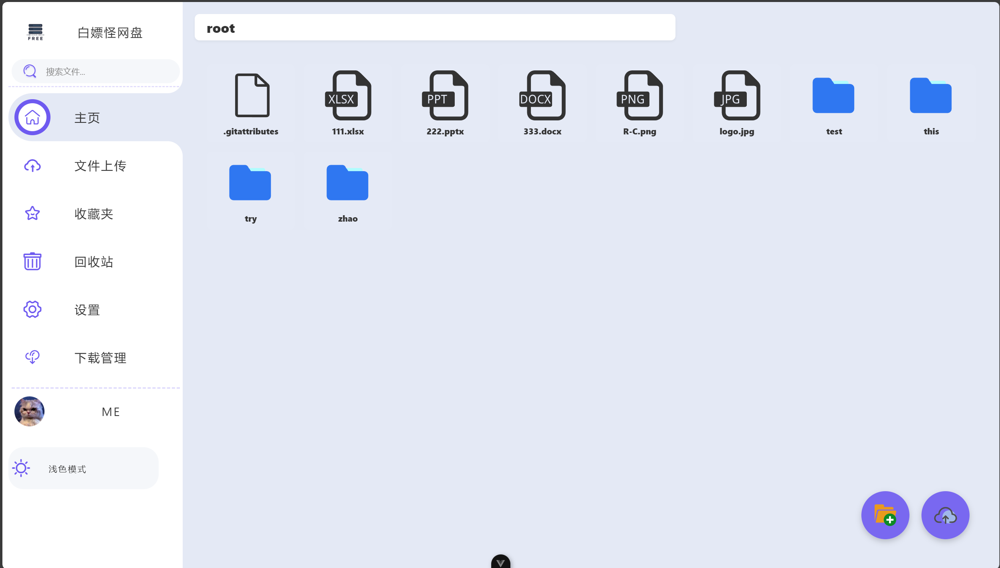

# 白嫖怪网盘 🚀

一个基于 Vue 3 + Vite 构建的现代化网盘系统前端项目。为用户提供便捷、高效、美观的在线文件存储和管理解决方案。



白嫖怪网盘后端项目[地址](https://github.com/Zmy0312bry/Free_Disk)

## ✨ 特性

- 🎯 **现代化技术栈**：使用 Vue 3 + Vite 构建，享受极速开发体验
- 🎨 **优雅的UI**：精心设计的侧边栏导航，流畅的动画效果
- 🌓 **深色模式**：支持浅色/深色主题一键切换，自动记忆用户偏好
- 🔍 **即时搜索**：强大的文件搜索功能，快速定位所需文件
- 📱 **响应式设计**：完美适配各种设备屏幕尺寸
- 🔒 **安全可靠**：完善的用户认证和文件加密机制

## 🚀 功能模块

- 📂 **文件管理**
  - 文件上传：支持拖拽上传、多文件批量上传
  - 文件下载：支持单文件/批量下载，下载进度实时显示
  - 文件预览：支持常见格式在线预览
  - 文件分类：自动识别文件类型，便于管理
- ⭐ **收藏夹**：一键收藏重要文件，快速访问
- 🗑️ **回收站**：文件删除保障机制，防止误删数据
- ⚙️ **系统设置**：个性化配置，包括下载路径设置、主题切换等
- 👤 **个人中心**：用户信息管理，存储空间统计

## 🛠️ 技术栈

- **核心框架**：Vue 3（Composition API）
- **构建工具**：Vite 6
- **路由管理**：Vue Router 4
- **状态管理**：Vue 内置的响应式系统
- **代码规范**：ESLint 9 + Prettier 3
- **UI组件**：自定义组件系统
- **图标方案**：iconfont 矢量图标库
- **HTTP请求**：基于API模块化的接口请求架构

## 📦 安装

```bash
# 克隆项目
git clone https://github.com/Zmy0312bry/free-disk-front.git

# 进入项目目录
cd free-disk-front

# 安装依赖
npm install
```

## 🚀 开发与构建

```bash
# 启动开发服务器
npm run dev

# 代码格式化
npm run format

# 代码检查
npm run lint

# 构建生产版本
npm run build

# 预览构建结果
npm run preview
```

## 📚 项目结构

```
free-disk-front
├── src/                  # 源代码目录
│   ├── api/              # API接口请求模块
│   ├── assets/           # 静态资源(CSS、图片、字体等)
│   │   ├── font/         # 字体文件
│   │   ├── images/       # 图片资源
│   │   └── style/        # 主题和样式
│   ├── components/       # 公共组件
│   ├── router/           # 路由配置
│   ├── views/            # 页面视图组件
│   ├── App.vue           # 根组件
│   ├── UserLogin.vue     # 登录页面
│   └── main.js           # 入口文件
├── public/               # 公共静态资源
├── instruct/             # 项目截图和说明
└── package.json          # 项目配置
```

## 🌈 主题定制

项目支持浅色/深色主题切换，主题配置存储在 localStorage 中，具备以下特性：

- **智能记忆**：自动记忆用户的主题偏好设置
- **平滑过渡**：主题切换时提供流畅的动画效果
- **组件级隔离**：组件级别的主题样式实现，提供更精细的样式控制
- **系统适配**：支持跟随系统默认主题自动切换

深色模式不仅保护用户的视力，在弱光环境下使用时也能提供更舒适的体验。通过顶部导航栏的主题切换按钮，用户可以随时切换主题模式。

## 📄 开源协议

本项目采用 [MIT 许可证](./LICENSE) 开源，欢迎贡献代码或提出建议。
