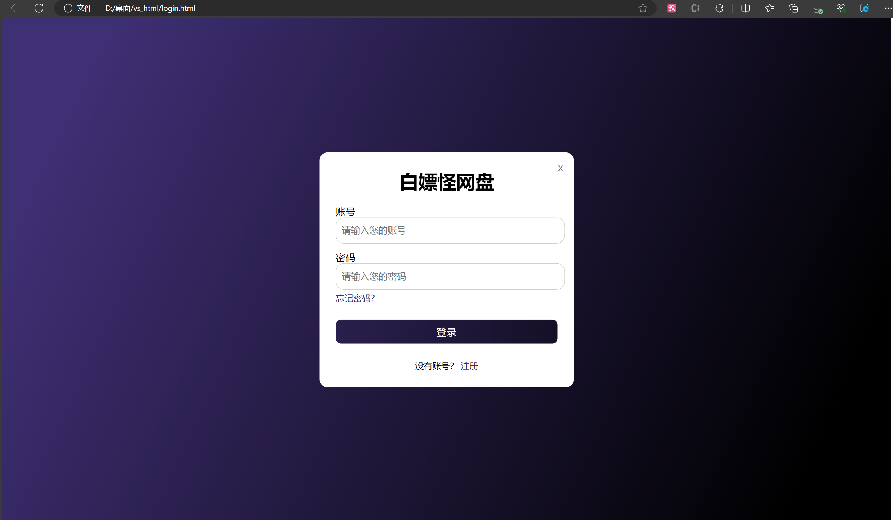

# 自由云盘前端开发说明

## 项目结构

开发内容主要集中在以下目录：
- `src/views/` - 存放所有视图页面
- `src/api/` - 存放接口请求文件

## 开发任务划分

### 当前完成状态
- `HomeView.vue` - 主页视图逻辑已完成

### 待开发页面
1. **个人中心页面** (`MeView.vue`)
2. **设置页面** (`SettingView.vue`) 
3. **登录页面** (`LoginView.vue`)

## 开发规范

1. `目前`每个视图文件顶部需包含该界面的简介注释
2. 每个页面的API请求需在 `src/api/` 下创建对应的JS文件
   - 例如：个人中心页面的API请求应当放在 `src/api/me.js`
   - 设置页面的API请求应当放在 `src/api/settings.js`

## 登录界面规范

登录界面需保留以下设计元素：

**注意：** 原有的登录按钮已废弃，不需要保留。

---
